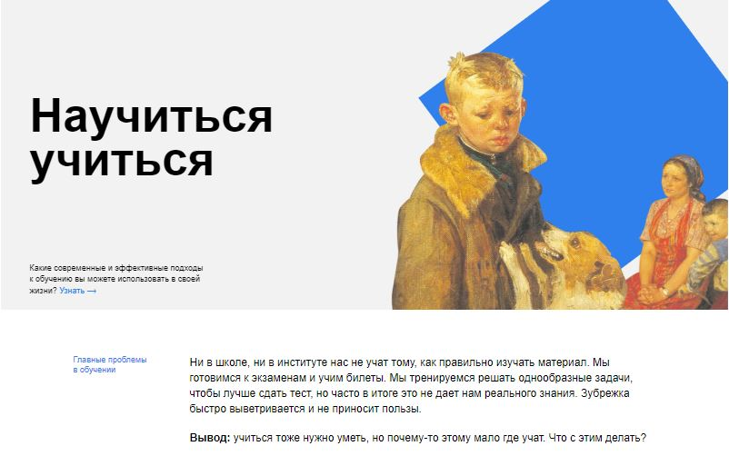

# Научиться учиться
-----
Ссылка на проект [GitHub Pages](lizapleshakova.github.io/how-to-learn/).



- Информативный и интерактивный веб-сайт с полезными советами по обучению.
- Используются современные технологии веб-разработки.
- Простой и интуитивно понятный дизайн, облегчающий навигацию по контенту.
- Полезные ресурсы и ссылки на дополнительное чтение и изучение.

## Как начать

Если вы хотите запустить этот проект на своем компьютере, вам потребуется клонировать репозиторий и открыть файлы в вашем браузере.

```bash
git clone https://github.com/lizapleshakova/how-to-learn.git
```

## Стек
- HTML5: Верстка и структура веб-страниц.
- CSS3: Стилизация и внешний вид веб-сайта.

## Что использовано

- Айфреймы видео из Ютьюб;
- Анимации картинок и блоков;
- Прозрачность ссылок при наведении;
- Методология БЭМ;

## Что запланировано
- Сделать верстку адаптивной для различных устройств

